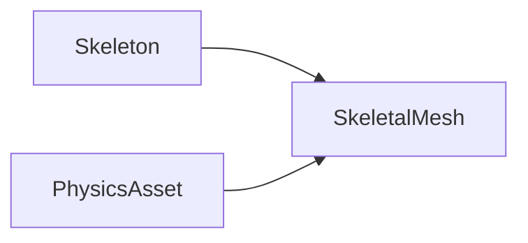

This page discusses meshes in general; it contains broad information relating to more specific pages, so they may reference this page.

This page's source is me for now.

Definition - A mesh is a combination of connected vertices. The connected vertices make edges and faces. Faces are what are actually visible. 
ex; Rover, PVC pipe, Person 

Unreal terms; 
## Skeleton and \<Static mesh v. Skeletal Mesh\>, 
First, the definition of a skeleton (SK); 
A skeleton is made up of bones and sockets. All bones are also sockets. Bones have a hierarchy, sockets do not.  
It is edited by the corresponding skeletal mesh, so in the skeletal mesh editor (see that page for more info). A skeleton can be bound to more than one skeleton mesh (SKM). If a skeleton is changed, there should be a prompt to save changes as new v. merge; new creates (and assigns?) a new skeleton asset with the changes, merge applies them to the original asset, and therefore to all skeletal meshes using it.

The difference between a static and skeletal mesh is whether or not you can move the vertices that make up the mesh independently from one another. I.e.,  
- A static mesh (SM) would "move" all the vertices at once in the same way, the vertices are always in the same location relative to each other.
  - Ex; PVC pipe
- A skeletal mesh (SKM) can move vertices in the mesh in different ways via a skeleton. Vertices are assigned to the skeleton via a process called **weight-painting**. Notably, this is made for "skin" materials, but most of our meshes are mechanical, so there is some key differences;
  - When it is mechanical, most of the time, each set of vertices that move is only connected to vertices that also move in the same direction, forming islands (you can have a set of islands moving together too). For this, a vertex should only be assigned to one bone, and therefore with a weight of 1. 
    - Ex; the mechanical rover Arm(s) don't stretch,  
  - "Skin" is for when vertices that are connected via edge or a face need to move differently. This is where non-true-false number weights come in.
    -  Ex; People, creatures, anything with proper skin, not rigid pieces.

See static mesh editor and skeletal mesh editor pages for more specific information.

# cuts
`Toolbox (left) -> Skeleton (top) -> Edit Bones`

