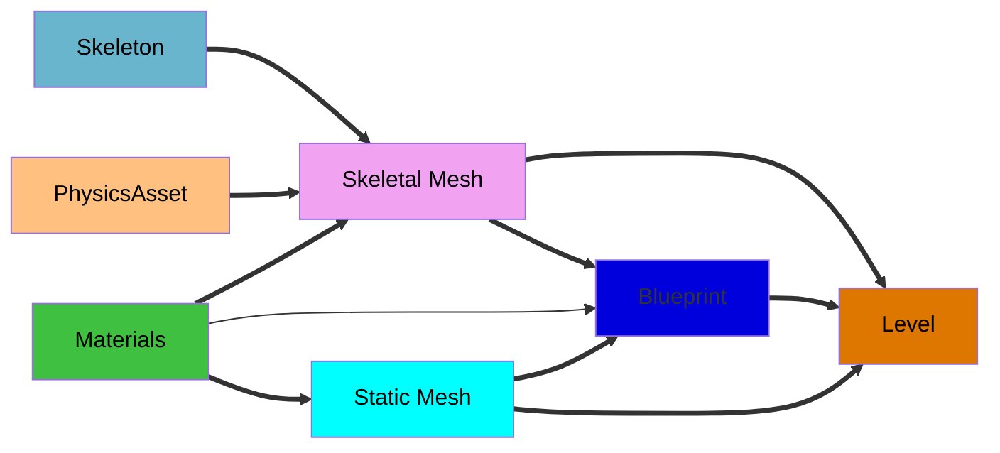

This page discusses assets viewable in the unreal editor; it contains broad information relating to more specific pages, so they may reference this page.

This page's source is me for now.

Blueprints
+ Blueprint Class

Used Regularly
+ Static Meshes and Skeletal Meshes, Skeletons, and Physics Assets
+ Materials, Material Instances, and Textures
+ Level

Used Rarely
+ Animation Blueprint
  + Blend Space 1D
  + Animation Sequence & Montage
+ Control Rig
+ Physics Material

Sets 
+ ZED set
+ Rover set

Deprecated (stuff we should be past using, so don't make, and shouldn't find)
+ Input action
+ Input Action context

# Blueprints
Blueprints can be classified themselves into many different sub categories. 
We want to phase out most blueprints because they suck to use, but many currently exist. Soon, most will be replaced with C++ files, which will be edited outside of the unreal editor.  

Blueprint class - seemingly, general blueprint. Very broad.
+ Actor - object that can be placed or spawned in the world
+ Pawn - actor that can be possessed, therefore receiving input from a controller
+ Character - Pawn that can walk
+ Player Controller - actor responsible for controlling the player's pawn
+ Game Mode Base - defines game being played, i.e. rules, scoring, etc.
+ Actor Component - reusable component that can be added to any actor
+ Scene Component - component with a scene transform that can be attached to another scene component

Widget Blueprint - for UI. Have an extra editor area for UI. Otherwise could probably be a normal blueprint.  
 
Other blueprints are niche enough to not include here or I don't know about them. 

# Regular
Assets that we use frequently enough that you should know what they are.

*Blueprints are their own nightmare, but are frequently what is actually placed into the level. 
*Some assets, like skeletons and physics assets, reference a mesh to display. These are not included. 
*Materials are by default inherited, so a blueprint's skeletal mesh instance will update if the skeletal mesh asset updates its materials. I don't believe the same is true for static meshes to skeletal.

## Static Meshes and Skeletal Meshes, Skeletons, and Physics Assets
First, mesh definition - A mesh is a combination of connected vertices. The connected vertices make edges and faces. Faces are what are actually visible. 
+ ex; Rover, PVC pipe, Person

Second, the definition of a skeleton (SK); 
A skeleton is made up of bones and sockets. All bones are also sockets. Bones have a hierarchy, sockets do not.  
It is edited by the corresponding skeletal mesh, so in the skeletal mesh editor (see that page for more info). A skeleton can be bound to more than one skeleton mesh (SKM). If a skeleton is changed, there should be a prompt to save changes as new v. merge; new creates (and assigns?) a new skeleton asset with the changes, merge applies them to the original asset, and therefore to all skeletal meshes using it.

The difference between a static and skeletal mesh is whether or not you can move the vertices that make up the mesh independently from one another. I.e.,  
- A static mesh (SM) would "move" all the vertices at once in the same way, the vertices are always in the same location relative to each other.
  - Ex; PVC pipe
- A skeletal mesh (SKM) can move vertices in the mesh in different ways via a skeleton. Vertices are assigned to the skeleton via a process called **weight-painting**. Notably, this is made for "skin" materials, but most of our meshes are mechanical, so there is some key differences;
  - When it is mechanical, most of the time, each set of vertices that move is only connected to vertices that also move in the same direction, forming islands (you can have a set of islands moving together too). For this, a vertex should only be assigned to one bone, and therefore with a weight of 1. 
    - Ex; the mechanical rover Arm(s) don't stretch,  
  - "Skin" is for when vertices that are connected via edge or a face need to move differently. This is where non-true-false number weights come in.
    -  Ex; People, creatures, anything with proper skin, not rigid pieces.

 

### Physics
Static meshes have hitboxes that don't move with respect to one another, like vertices. They can be viewed and modified in the static mesh editor, and are contained in the static mesh asset itself. They consist only of primitives.  
 

Skeletal meshes use a physics asset to organize their hitboxes, constraints, etc. The Physics Asset has three main additions on top of the skeleton; physic bodies, primitives, and constraints.  
Physic bodies are groups of primitives, and contain properties like mass, dampening, gravity, etc.
+ Always attached to a single bone
+ List of Primitives for a physics body can be viewed in the `Details` panel after clicking the physics body or by revealing them in the `Skeleton Tree` panel 

Primitives are the actual shapes that make up the collision area; 
+ they can be custom (convex category?), otherwise they are boxes, capsules, or spheres (some other niche ones).
+ collisions are made with a combination of the primitives. Making new body types requires copying them from something that already has them; some static meshes serve the specific purpose of holding these sets of primitives.
+ List of Primitives for a physics body can be viewed in the `Details` panel after clicking the physics body or by revealing them in the `Skeleton Tree` panel 

Constraints connect and limit physics bodies.
+ This includes both angular and linear limits
+ Always between two bodies, but the parent varies.
+ very weird and complicated, see Physics editor

### Editors
Static mesh editor for static meshes. 
 
Skeletal mesh editor for Skeletal meshes and Skeletons. 
Skeleton editor for Skeletons; as of yet, never used. 
Physics Asset Editor for Physics Assets. 

## Materials, Material Instances, and Textures
Materials are the things used to provide colors and texture to assets. They use nodes. 
Material Instances and Textures are less frequently used.  
 
I am generally unfamiliar with the specifics of the relationship between material instances and materials.  
 
Textures are, as far as I can tell, mostly imported - that is to say, you can't change them much. They are effectively images. 
Materials can mimic textures through some weird math, but it tends to be better/easier to just have a texture. Materials can use textures directly. 
 
Materials are put in "material slots" of assets (just meshes as far as I can remember). A material slot is associated with a group of faces, and through a UV map, maps the material onto those faces. As far as I'm aware, what faces are assigned to each material can't be modified in unreal, so to change it you need to do so in blender and reimport. Many assets imported by me (some rovers, arms) have not had their UV maps specifically set up; bad UVs make it difficult to properly texture an asset, as the texture distorts.  
 
It is frequently much easier to (at least with cad models) simply have "constant" materials; a color effectively without texture. CAD models come with materials already assigned to vertices; these can then be combined into just a few materials (redundancy comes from pieces designed separately and combined).  
 
A mesh could be entirely textured with just one material through using UVs over a complex image (like sprite-sheets). This would allow for one material per asset, and one asset per material; this guarantees changing the material only affects that one asset. However, sometimes it makes sense for multiple assets to use the same material; 
+ for example, there is a texture for shiny metal (might be aluminum?); making it more accurate means everything with that assigned aluminum gets the update. However, as it is "metal", some meshes that use it may have only looked right with the previous version, so it is important to differentiate between specific materials (aluminum) and general use materials ("metal"). The workspace is not currently in line with this practice, as aluminum is just the "metal".

In short, use the general to color things for contrast rather than realism. Use specific materials if you know what a specific piece should be. 

### Materials folder
The materials folder, referenced in some other doc about the directories, contains five parts currently (hopefully soon updated);
+ CommonColors; colors named after their hexadecimal, for use in general coloring. May be possible to make instances, may not be a point.
+ ComplexMaterials; specific materials, frequently with non-default roughness and/or shine, transparency, and even texture, but also materials for specific sets of assets, including both the Equipment Servicing and Athena's shades of reds. The material for aluminum is also here. 
+ LEDs; originally in this directory. Material for the LED Panel, and the texture that it uses.
+ Material Functions; a singular Material function, which creates a checkerboard. May effectively be a texture generated via math like the materials.
+ Physic Materials; friction and such materials. not like normal materials

Some textures/materials ARE only used by one-ish specific asset, as in the case of the autonomy objects and tags, so those materials are left with them. 
 

Practice should be as follows;
+ One very unique one off asset, like the rock pick, people, and tags? Keep it's materials with it
+ Specific colors, like for Athena's shades of red? In its own complex materials folder, as we sort by `Module` then `Year`, so there is no `2026` folder.
+ Actually "Material" materials, like aluminum? ComplexMaterials, as it is used more widely and should have its updates affect all that use it.
+ General colors, like making something yellow? CommonColors. Should be named by hexcode, so the materials themselves shouldn't be changed.

Keep in mind that, when adding assets, they use the logical ones to get from these folders. Fine to add to common colors if there isn't the color needed, but do consider if the asset using it should have its own group of materials.

### Editors
Material editor, for materials, and seemingly also material functions. 
Material Instance Editor, for material instances. Seemingly no nodes, just some parameters (colors and such) that can be changed 
Texture editor, for textures. Not really an editor; mostly viewing, plus detail categories `[ Level of detail, Compression, Texture, Adjustments, File Path, Compositing, Interchange]` 

## Levels

Effectively a "map", where the player actually plays in. Also where you usually press play to test the game. 
Can only have one map open at a time as far as I'm aware. 
There are some weird lag spikes when using a default map, likely because of Ultra Dynamic Sky not being there. 
 
Technically a partially a blueprint; access via the blueprint button (node connecting to two other nodes symbol, top bar below tab) --> level blueprint 
 
Not currently much to say here, as its fairly obvious what a level is, and most other things are more specific case. 

Editor - Level editor. Should definitely make, some of the buttons are weird.

# Rarely Used
Assets that we don't use much.
Lower priority tutorial/information.
None of the things currently on that list, at least, should be used often. 
# cuts
`Toolbox (left) -> Skeleton (top) -> Edit Bones`
