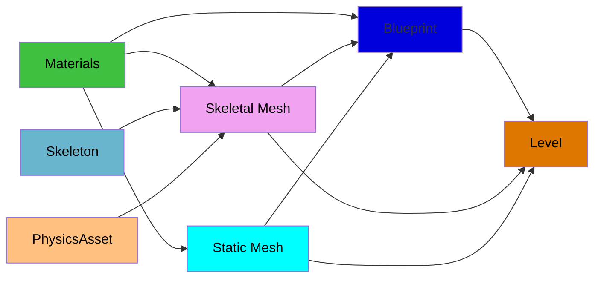

This page discusses assets viewable in the unreal editor; it contains broad information relating to more specific pages, so they may reference this page.

This page's source is me for now.

Blueprints
+ Blueprint Class
Used Regularly
+ Static Meshes, Skeletal Meshes, and Skeletons
+ Materials, Material Instances, and Textures
+ Physics Asset
+ Level
Used Rarely
+ Animation Blueprint
  + Blend Space 1D
  + Animation Sequence & Montage
+ Control Rig
+ Physics Material
Sets 
+ ZED set
+ Rover set
Deprecated (stuff we should be past using)
+ Input action
+ Input Action context

# Blueprints
Blueprints can be classified themselves into many different sub categories. 
We want to phase out most blueprints because they suck to use, but many currently exist. Soon, most will be replaced with C++ files, which will be edited outside of the unreal editor.  

Blueprint class - seemingly, general blueprint. Very broad.
+ Actor - object that can be placed or spawned in the world
+ Pawn - actor that can be possessed, therefore receiving input from a controller
+ Character - Pawn that can walk
+ Player Controller - actor responsible for controlling the player's pawn
+ Game Mode Base - defines game being played, i.e. rules, scoring, etc.
+ Actor Component - reusable component that can be added to any actor
+ Scene Component - component with a scene transform that can be attached to another scene component
Widget Blueprint - for UI. Have an extra editor area for UI. Otherwise could probably be a normal blueprint.  
 
Other blueprints are niche enough to not include here or I don't know about them. 

# Regular
Assets that we use frequently enough that you should know what they are.

*Blueprints are their own nightmare, but are frequently what is actually placed into the level. 
## Static mesh, Skeletal Mesh, Skeleton 
First, mesh definition - A mesh is a combination of connected vertices. The connected vertices make edges and faces. Faces are what are actually visible. 
ex; Rover, PVC pipe, Person 

Second, the definition of a skeleton (SK); 
A skeleton is made up of bones and sockets. All bones are also sockets. Bones have a hierarchy, sockets do not.  
It is edited by the corresponding skeletal mesh, so in the skeletal mesh editor (see that page for more info). A skeleton can be bound to more than one skeleton mesh (SKM). If a skeleton is changed, there should be a prompt to save changes as new v. merge; new creates (and assigns?) a new skeleton asset with the changes, merge applies them to the original asset, and therefore to all skeletal meshes using it.

The difference between a static and skeletal mesh is whether or not you can move the vertices that make up the mesh independently from one another. I.e.,  
- A static mesh (SM) would "move" all the vertices at once in the same way, the vertices are always in the same location relative to each other.
  - Ex; PVC pipe
- A skeletal mesh (SKM) can move vertices in the mesh in different ways via a skeleton. Vertices are assigned to the skeleton via a process called **weight-painting**. Notably, this is made for "skin" materials, but most of our meshes are mechanical, so there is some key differences;
  - When it is mechanical, most of the time, each set of vertices that move is only connected to vertices that also move in the same direction, forming islands (you can have a set of islands moving together too). For this, a vertex should only be assigned to one bone, and therefore with a weight of 1. 
    - Ex; the mechanical rover Arm(s) don't stretch,  
  - "Skin" is for when vertices that are connected via edge or a face need to move differently. This is where non-true-false number weights come in.
    -  Ex; People, creatures, anything with proper skin, not rigid pieces.
 
Skeletal meshes have hitboxes, constraints, etc. for physics based interaction in an attached Physics Asset (see that section for more info). 
Static meshes have theirs in their editor.  
 

### Editors
Static mesh editor for static meshes. 
 
Skeletal mesh editor for Skeletal meshes and Skeletons. 
Skeleton editor for Skeletons; as of yet, never used. 

## Materials, Material Instances, and Textures
Materials are the things used to provide colors and texture to assets. They use nodes. 
Material Instances and Textures are less frequently used.  
 
I am generally unfamiliar with the specifics of the relationship between material instances and materials.  
 
Textures are, as far as I can tell, mostly imported - that is to say, you can't change them much. They are effectively images. 
Materials ............
 
Materials are put in "material slots" of assets (just meshes as far as I can remember). A material slot is associated with a group of faces, and through a UV map, maps the material onto those faces. 
Materials 

# cuts
`Toolbox (left) -> Skeleton (top) -> Edit Bones`
