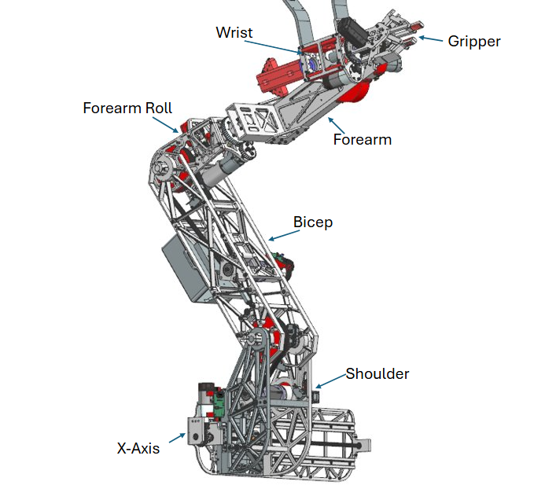
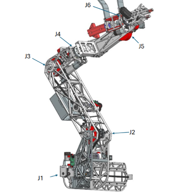

Initial Arm Development and Implementation Process
# Under Development
 
## Overview
1. Skeletal Mesh
   The model of the arm; what you see.
2. Skeleton
   Base setup for moving/manipulating the mesh (#1)
3. Control Rig
   Set up for manipulating the bones (#2) which manipulate the mesh. Necessary piece inbetween skeleton and actual control values 
4. Blueprint
   Container that connects the previous assets together with other things, such as the keyboard inputs and the lasers.
5. Physics Asset
   Hitboxes and such.
6. Futher notes
   Additions made/to be made after implementation, such as switching to the enhanced input system and better physics.   
## Skeletal Mesh
#### Pre-Unreal
Due to the sheer size (# of pieces and vertices) of the arm CAD file, it was decided that it would be easier to make the arm manually with measurements---with the exception of the gripper---rather than process the CAD file directly.
#### Unreal
Generally negligable; control rig assigned as default animation rig.
## Skeleton
One bone per joint/axis; J1/x-axis though J6
Gripper has an ten bone structure; 5 for the left, 5 for the right; 4 are in a chain, and the last of them does not affect the mesh, but instead acts as a reference for the one bone not in the chain.
## Control Rig
The control rig contains controls; one for each joint J1-J6, one for the solenoid, and one for each side of the gripper. The each of the gripper's controls modifies the rotation of two bones; one to move the sides entirely, and another to keep the jaws straight. Additionally, the reference bone is used to point another bone toward it.
The Forwards solve updates the bones bases on the controls as the game runs (every frame or something). The Construction script runs when the object is constructed; this means it actually runs in the Blueprint as well---this can be seen by selecting the control rig in the blueprint. The Construction script sets up the arm's default position (changing it can make testing far more convenient, but make sure to set it back).
## Blueprint
## Physics Asset
## Further Notes
Future Additions/Lacking Implementations
+ Enhanced Input is not yet implemented; this is a system has input in specific assets rather than a total menu in settings. High priority, likely done before anyone else sees this.
+ Gripper starts...pincering? after it is no longer able to close normally. This gives it more contact, but is complex skeleton wise. Would also need...
+ ...advanced physics interactions; gripper and solenoid both ignore/override things in the way, e.g. closing completely on a cube, which would not normally be possible. Potential Solution; double the skeleton, with one set up with the controls, and the other set up to follow them with a certain amount of force. Allows for a desired position and an actual position to exist.  
## Overview

++++++++++++++++++++++++++++++++++++++++++++++++++

## Pre-Unreal: Measurements, Mesh, and the CAD Gripper 
Due to the sheer size (# of pieces and vertices) of the arm CAD file, it was decided that it would be easier to make the arm manually with measurements---with the exception of the gripper---rather than process the CAD file directly. The given measurements are as follows; 
x-axis - 21 inches long, 6 inches tall, *Depth*
Carraige - 1 inch of thickness, *height and length* made to match shoulder connection
Shoulder - 5.5 deep from x-axis out, 4.5 side to side, bottom of shoulder level with bottom of x-axis, 
+ **5.7 in wide?** - *not sure what this is, but also written down*
+ **pivot** placed by "5.5 deep from x-axis out" (might not be actual position) and 11 inches above the bottom (of the x-axis) (this part was under bicep, may also be incorrect)
Bicep - pivot (J2) to pivot (J3): 18 in., *depth - fit between shoulder*
Forearm roll - pivot (J3) to pivot (J4) 7.3 inches
Forearm - J4 to "pivot on wrist" **(J5 or J6)** - 11.2 in
Wrist - **no measurements :(**
+ Camera (near gripper, kinda wrist) - Used an image to approximate.

Gripper - **unknown/forgot to write down/get.** Used an image to approximate 

\*\*Bold values are lost/unclear/weren't measured, italized are creator's choice due to negligiblily (also not measured). 

The Gripper was exported without bolts/screws/whatever-I'm-not-mechanical, as an .obj file with measurements set to inches (maybe unnecessary, see next section). A toggle I forget the name of seemed like it would be good to press, but actually caused a bunch of things to have scrambled rotation.
**Double check that the file you get (if you get one) has correct position and orientation. Scale may not matter (or work), but you will want them rotated correctly and positioned so one side is a mirror of the other (rather than one being full up and the other full down or whatever)**

### Creating the mesh
The Mesh was created in Blender. May want to see some tips on how to use it.
The mesh was set up so the lower-left?-rear point of the x-axis is at the origin. 

To make your measurements
1. set up units to be inches (or whatever you are using) by going to Properties (a window type) -> Scene -> Units. 
2. go into edit mode (top left, or click tab sometimes) **after** selecting the mesh (create one if necessary) 
3. select a vertex, press "e" to extrude (create a new vertex connected to the old one), press "x"/"y"/"z" (locks the movement of the vertex to one axis) and type a number (extrude that number of inches in chosen direction)
4. Repeat to create the distances in the file. You can use the measure tool (too long to explain here) to double check your work.

The Pivots
1. The x-axis doesn't need much, but don't forget the carriage exists. I made it shaped like an "I" / sidesways "H", but I geniunely forgot what it looks like.
2. At J2 and J3, creating a cyclinder and a tube bigger than the cylinder at each of the points works well.
  + use ctrl-r and face extruding to get the tubes connected. You may want to cut your tube to have extra disks at both ends to connect the cylinder on one side.
3. At J4 and J5, inseting (extrude down along normal z) a circle base to create a hole for a cylinder works well. Adding the cylinder for the other piece. 

The Gripper
*quick tip! hover over something with your mouse and press "l" to select everything <u>linked</u> to it. This changes slightly if you are in vertex v. face selection mode*
1. Before you join it with everything else, you should probably scale it correctly; importing with .obj (in my experience) doesn't preserve units. It will likely be placed in meters, so look up the conversion and (in edit mode) scale down the whole thing by the right value.
2. Also before you combine it, you can...
   + press "p" in edit mode to separate things, including by loose parts. If you go to "3D Viewport" (window type) -> "Show Overlays" arrow (top right) -> "Statistics" checkbox, you can see how many vertices each thing has. You may want to get rid of the less significant but large vertex count pieces, such as the gears. Otherwise...
   + Using "limited dissolve" (select stuff, press x) can make level triangles turn (back?) into quads, which is better for selection
   + Using "m" or auto merge can reduce the vertices of curves. You can change the threshold for auto merge, and it only applies to stuff you actually move, so if you want some specific pieces to simiplify just select them and press "g" and then "0" to move them no where, activating auto merge. Be careful to keep pieces separate; this will help you later.
   + Decimate. The. Mesh. Do so in the properties tab; Modifiers -> add modifier -> generate -> decimate. The bar-value thing is how much to keep; I found 40% (0.4) changed very little of the geometry, even on the gears, but still reduced vertices to 40% of the original value.
4. You can use ctrl-J to join two meshes together; this can put the gripper pieces back together and combine the gripper with the main mesh. Order of selection should only matter for things not relevant to this tutorial.

Materials were added to each segment of the arm, with most of the gripper being one material. 

### Exporting

Make sure the thing you are exporting is at the origin. The offset will be taken into account when it is packaged.

Go to file -> export -> .fbx (for meshes, and **not the experimental one**)

I suggest using "Include" -> limit to -> "selected objects" and changing object types to just "mesh." Also change "Forward" to Z forward rather than -Z. You can save these presets for later use.

### Importing into Unreal

In the content browser, select "import." I imported it as a static mesh and converted it, but may work better to import it as a skeletal mesh. 
*tip: at least with the static mesh, you can use a reimport button to have unreal reimport the asset from the same file location. Good if you make some changes to the blender version and re-export. Noteworthy that it does not affect the skeletal mesh you create off it. Untested on importing and then reimporting for the skeletal mesh, but other experience found nonsensical conflicts. Unreal truly is one of the Game Engines of all time.*

Should be done as quick as that, though if you experience a bug (crash level) with weight painting later, you may want to see the entry on bugs.

## Controlling the Arm
|++++|++++|-|\_|-|\_|-|\_|-**Construction**-|\_|-|\_|-|\_|++++|++++|
For 2025, the arm was controlled by an xbox controller with the following keybinds;
+ Right stick
  + Left-Right: X-axis
  + Up-Down: J2
+ Left stick
  + Left-Right: J4
  + Up-Down: J3
+ Triggers: Pitch
+ Bumpers: Roll
+ D-Pad Left-Right: Gripper
+ A, B: Laser
+ X, Y: Solenoid

Additionally, for use with only a keyboard, the following bindings were placed;
+ x-axis/J1; z-x
+ J2 (shoulder-bicep) - shift-ctrl
+ J3 (bicep-forarm) - w-s
+ J4 (forearm roll) - a-f
+ J5 (wrist up-down) - e-d
+ J6 (gripper roll) - q-r
+ Gripper Open-close; v-c (c to close, v shape when open)

Finally, the following keys were used for extra features;
+ 0 - camera switch

The arm has several pieces.
+ Static mesh
  + Holds a nonmovable version of a mesh.
  + Unnecessary unless you need to remake the skeletal mesh.
  + Made with import; avoidable.
+ Skeleton
  + Holds the bones of the skeletal mesh.
  + Made with skeletal mesh, but can also be made solo if going through more options. 
+ Skeletal mesh
  + Holds the mesh (vertices and stuff), also connects to skeleton?
  + Modify the skeleton, give vertex weights (weight painting), change materials (colors and textures), and possibly alter the mesh itself here (I did any changes in blender and reshipped. Feature untested).
  + Created from static mesh; options allow for it to make a new skeleton or use an existing one.
+ Blueprint
  + Relates many components together. Also contains assets like cameras.
  + Contains some node logic; currently only known area that can access input axis and input actions.
  + 
+ Control Rig
  + Contains controls that reference the skeleton it was created from.
    + "Controls" are basically elements made to simplify the moving of bones; a control could move and have several other bones copy its movement, or the controls could be targets of things. For reference to how minor they are, in Blender, "controls" themselves don't actually exist, people just use bones that don't have any assigned weights.
  + In the contr
  + Created from Skeletal Mesh

What was done; 

What's done where;
+ In control rig-editor, you modify bones based on controls.  
+ In the main (arm) blueprint, the controls are given values based off control inputs. This isn't done all in one thing because the main blueprint doesn't have access to the bones, and the control rig doesn't have access to input.
  + Additionally, because there are two layers, limits are actually applied twice; from the input to the controls, and once from the controls to the bones.
  + "Fun" fact; the control rig and main blueprint have access to what may be entirely different sets of nodes. Even the add nodes are different. (This is really annoying for copy-pasting)
+ The control inputs are made in Project Settings -> Input (see "How" section later)

How to;
+ 
+ Add a (bone) control by right 

## What was done;
Static mesh, Skeleton, Skeletal Mesh
+ Converted imported Static Mesh to Skeletal Mesh. Created a skeleton. Resolved a problem with bad geometry (bug). Weight painted skeletal Mesh. 

Control Rig
+ Created from Skeletal mesh
+ Added controls (right-click bone in heirarchy) for xAxis, J2 through J6, and one each for left and right gripper. Separated controls from the bone heirarchy, but maintained a control heirarchy.
  + Left and right gripper are G1R and G1L. G3R was an attempt to add an extra, more complicated (and not finished) rotation.  
+ Nodes
  + Controls by themselves don't change the bones. Need nodes.
  + From Forwards solve, offset transform of bone(s); value for offset first from a control, then clamped (possibly redundant measure, see blueprint). Ordered from furthest out to furthest in the hierarchy.
    + All of Gripper Right before gripper left.
    + Drag controls and bones from the Rig Hierarchy window to get nodes easier.
    + Some of the gripper math (led up to G3R) may be unnecessary; not sure if both x and y should be affected, can't be bothered to check. 

Animation Blueprint
+ Created from Skeletal mesh
+ Potential alternative to control rig, but I couldn't figure it out, and it may be for true "animations" (clip of movements). May still be necessary.
+ Only note; control rig node set up as the only (significant) node between what is effectively input and output for the animation node. Any setting changes are unknown.

General Settings
+ Input Controls were made via Edit (Top bar) -> Project Settings -> Input (Left side, Engine section)
  + There is a warning about Enhanced input. It *may* be irrelevant; I am uncertain whether we are actually using it
+ Its an axis if you might ever want it bound to a joystick---or if it has opposite poles, rather than a toggle or selection option.
+ Alternatively; if you need two buttons for the main functionality, its an axis. If its not 2/not possible to organize as pairs, its probably an input action.

Blueprint
+ Created Blueprint as "Pawn", added skeleton mesh, cameras, control rig
  + Added cameras into the blueprint via the Components (left) -> "+ Add" button -> Camera. Moved the "real" one in the heirarchy to be a child of the skeleton mesh, then assigned it to a bone; selected camera, then in Details (window) -> Sockets -> Parent Socket used the file-search button to assign bone of choice. Rotated as necessary in viewport. Second Camera is an outerview for testing purposes; essentially convient freecam, since you can't move things while in freecam as far as I'm aware.
  + Added the Control rig. 
+ Read from input by adding input actions nodes in the blueprint; right-click to pull up a search-and-add menu; search for "InputAction" *or* "InputAxis" and you should be able to select the one you need (names are convenient)
+ Feed the process order (white triangle bar thing) into the function "Bone Control," a function I made for this to significantly condense the code. Heres a guide to the parameters/input;
  + white triangle-house-pentagon thing; evaluation order. Won't run if you don't start it, so connect it to the input axis.
  + Target; uncertain: not an actual chosen parameter, I believe it is something to do with the space it evaluates? Should just stay as "self."
  + Input Axis; how much the input axis...is? Feed "Axis value" from the input axis node into this.
  + Control Name; name of the control to affect. Must be exact. No dropdown because this isn't in the control rig :(
  + Rot(T) or Transf(F); Whether to affect the rotation or transformation (turn or relocate). The (T) and (F) show true and false
  + Rate XYZ; the rate to change x, y and z, for the choice of transformation or rotation. If a value is zero, it does not change that axis.
  + Limit; boolean for whether or not to limit the bone. Important if something can rotate indefinitely.
  + Min XYZ; minimum values for x, y, and z that the control can be transformed to.
  + Max XYZ; maximum values for x, y, and z that the control can be transformed to. 
+ Canera switch was also set up here; it just checks what camera is active, sets the new to active and the original to inactive. No complexity for more than 2 cameras (yet)

Physics
+ 

Extra Notes; 
+ Want to remove a connection between 2 nodes? Ctrl-click.

|++++|++++|-|\_|-|\_|-|\_|-**Construction**-|\_|-|\_|-|\_|++++|++++|
## Extra Things

## Out of Order Changes
If you alter the original mesh, you can right-click on the mesh in unreal and reimport it. May not update things based on it, however. 
If you make a change to the skeleton after creating the control rig, right-click on the Root bone (the total parent bone) -> Assets (section) -> Refresh -> select the skeletal mesh.
## Venting and bugs
Process Location: Importing the created mesh, weight paint the mesh

#### Issue: 
Unreal Crashes after pressing accept on weight painting.
To be specific, it gives an error message of an "index out of range" error; its not very specific as to what it applies to, but it is the basic "list is # elements, list\[#\] does not exist (b/c 0 is the first entry, so # is the first entry out of range)"
Only occurs when you click "accept" after weight painting. Uploading seems uneffected.

#### Understanding: 
Importing and w-painting different objects was successful. Led to finding that it wasn't the file. 
Importing and w-painting the same object but with pieces removed was successful. Led to finding that it was specific geometry that was the problem.

#### Resolution: 
Geometry fixed on bicep and the gripper's actual gripping surface. Gears also had problematic geometry, but were too complicated to disconnect and sift through, so they were instead deleted. May be left over materials in blend and uasset files.
