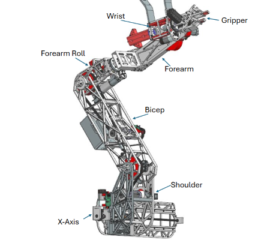

## Controls
This is the page for all the controls for using RoveSoSimulator.

This includes;
1. Overarching
2. Rover
3. Arm

### Overarching Controls
This is the page for controls that are always present no matter what the player has control over.

12345678890 --- Soon to be a specific possession choice for each one, including rover, autonomus rover, arm, in the further future drone, and nothing.

\+ and - --- Soon to be a way to cycle through options 123...890. For now (2/3/2026), bound to arm possession.

\[ and \] --- Camera Cycle. Currently only on arm and only cycles through arm's cameras.

; --- Unreal's debug camera. *Chance* it won't work

## Rover Controls
This is the page for controlling the rover.

q and a --- Left power

e and d --- Right power

*\*use left and right together to go forwards or backwards*

T --- Teleop toggle. Use when you want to drive the rover. Also hides ZED camera and reveals arm.

h and j ????? --- Waypoint ?????

P --- Toggle point cloud visibility
\n
Soon to be reorganized menus;

b - basestation (broke and fixed? today 2/3/2025)

m - multiplayer (nonfunctional 2/3/2026)

enter - scene menu (whether effects)

## Controlling the Arm
 

Switching to the arm currently involves toggling teleop (T) so the rover is in manual drive, which should also reveal and activate the arm, then press - or + to take control. Pressing + or - again will swap back. Will later be switched to a specific number.
*\*Also, pressing +/- the first time you start the game doesn't trigger the swap, for some reason.*
For 2025, the arm was controlled by an xbox controller with the following keybinds;
+ Right stick
  + Left-Right: X-axis
  + Up-Down: J2
+ Left stick
  + Left-Right: J4
  + Up-Down: J3
+ Triggers: Pitch
+ Bumpers: Roll
+ D-Pad Left-Right: Gripper
+ A, B: Laser (on, off)
+ X, Y: Solenoid (out, in)

Additionally, for use with only a keyboard, the following bindings were placed;
+ x-axis/J1; z-x
+ J2 (shoulder-bicep) - shift-ctrl
+ J3 (bicep-forarm) - w-s
+ J4 (forearm roll) - a-f
+ J5 (wrist up-down) - e-d
+ J6 (gripper roll) - q-r
+ Gripper Open-close; v-c (c to close, v shape when open)
+ Solenoid - y-t (out-in; Pull the center line of T away from the rest to make Y)
+ Lasers - g-h (g for li***g***ht, h for hide)
+ Camera Switch - \[-\]

*\*there may also be a level editor...or maybe thats in scene menu*
